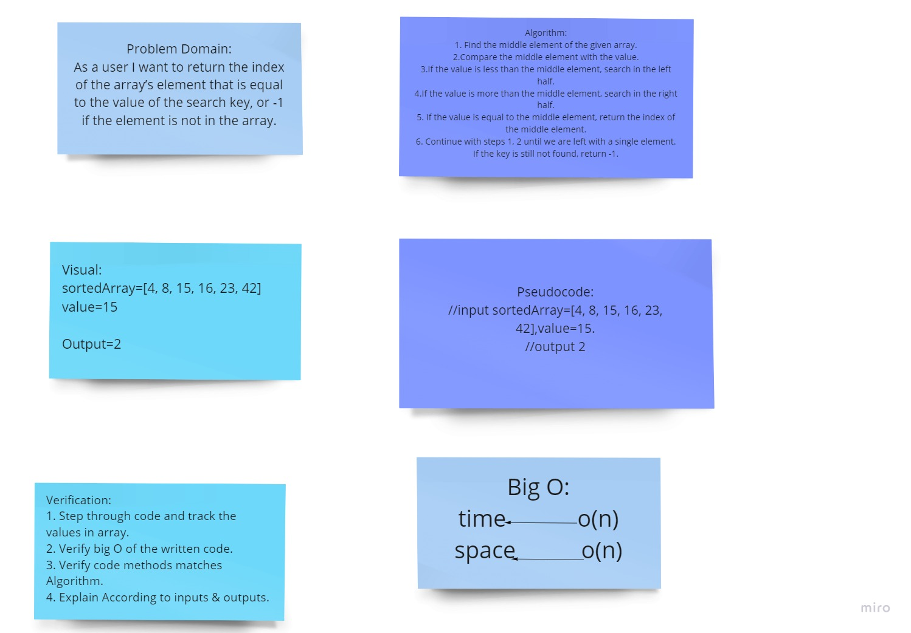

# Insert to Middle of an Array

This is a program can find the index of sorted array for any value using binary search algorithm.

## Whiteboard Process

  

***[CODE](./code.js)***
 

## Approach & Efficiency
o determine the efficiency of an algorithm with respect to the number of inputs. In other words, it’s how we measure the performance or run time of an algorithm
