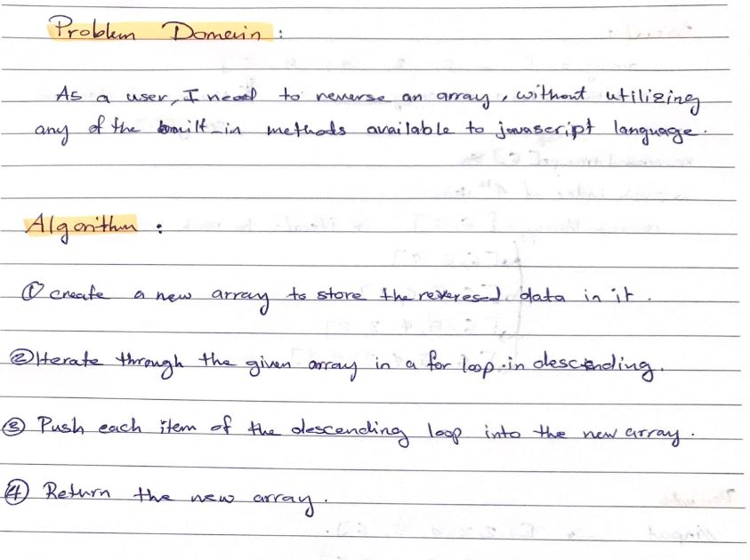
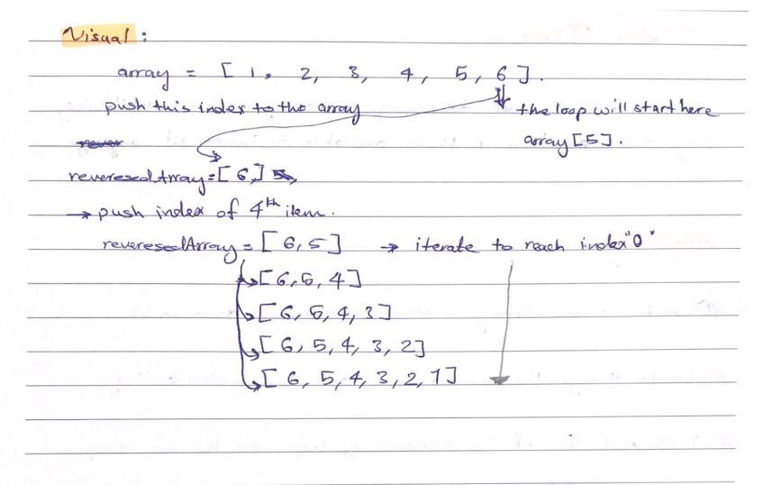
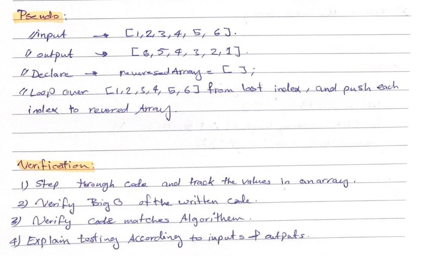
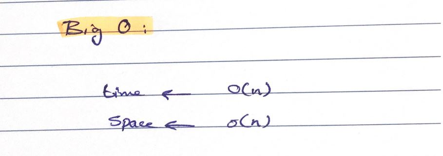

# Array Reverse

This is a program takes an array and return a reversed array without using built-in methods.

## Whiteboard Process

  
  
  
  
## Approach & Efficiency

o determine the efficiency of an algorithm with respect to the number of inputs. In other words, it’s how we measure the performance or run time of an algorithm.

