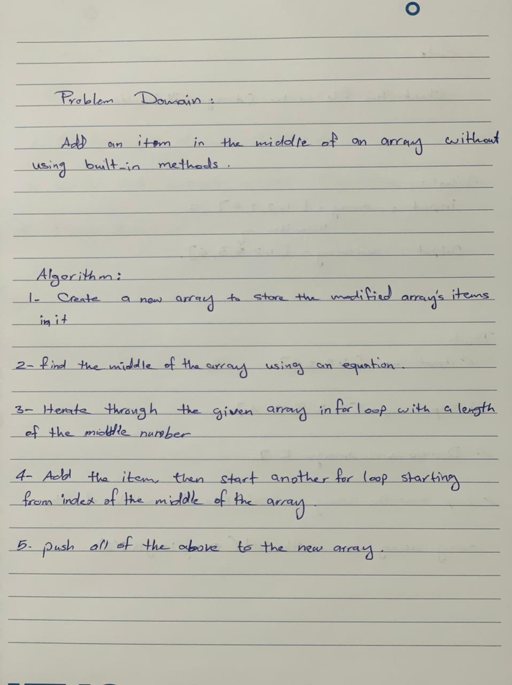
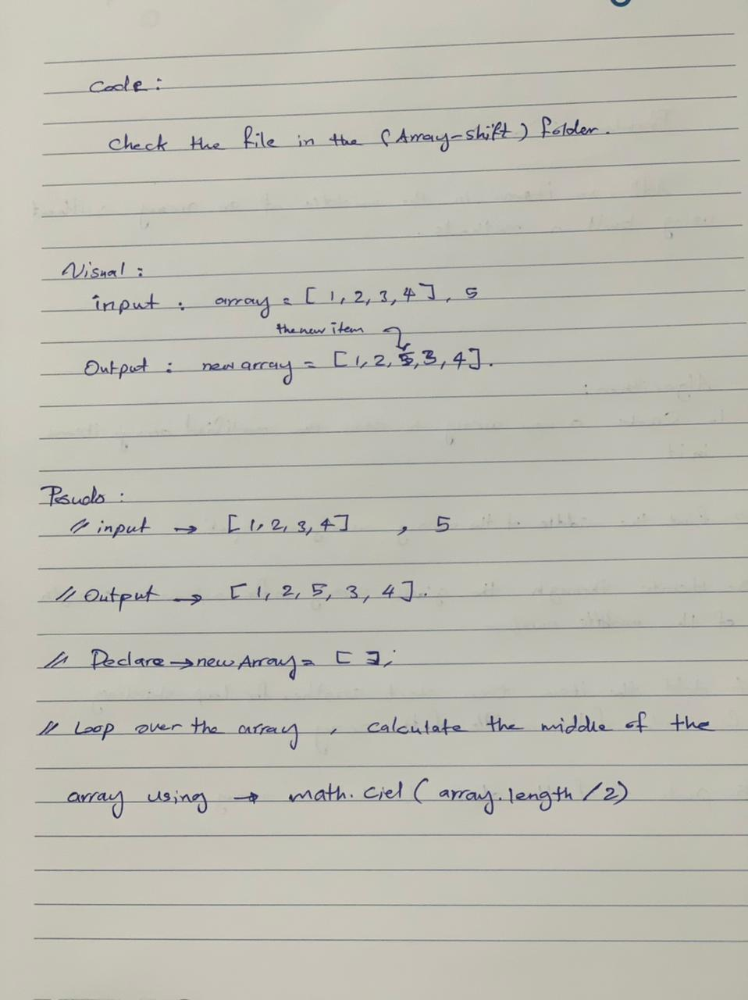
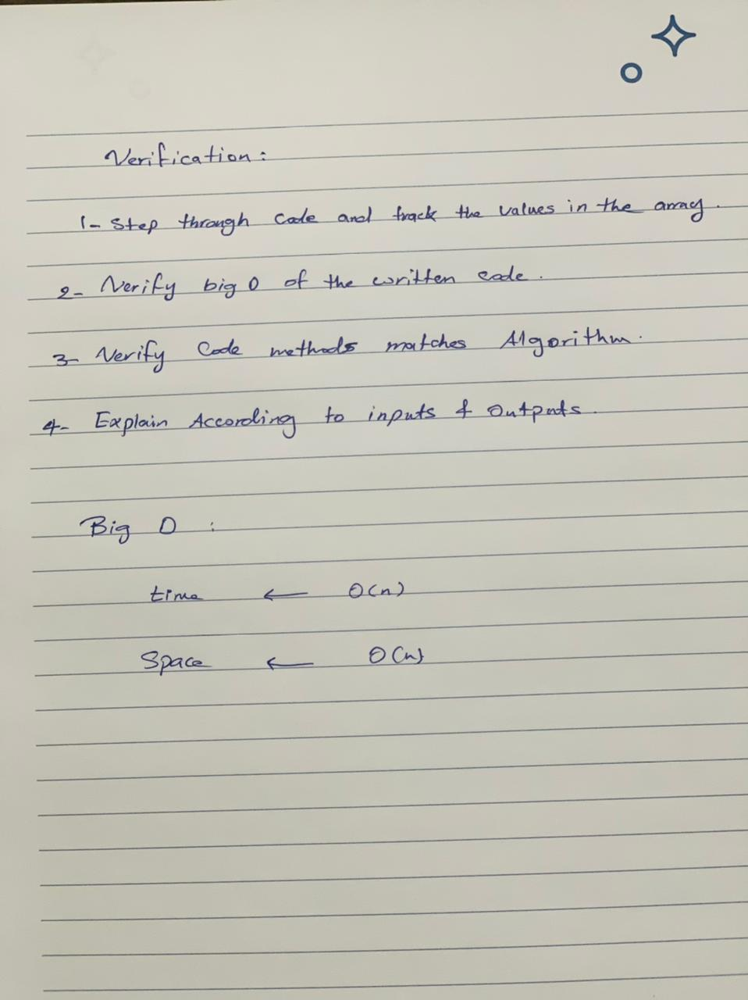

# Insert to Middle of an Array

This is a program can add item to middle of an array, without using built-in methods.

## Whiteboard Process

  
  
  

***[CODE](./code.js)***
 

## Approach & Efficiency
o determine the efficiency of an algorithm with respect to the number of inputs. In other words, it’s how we measure the performance or run time of an algorithm