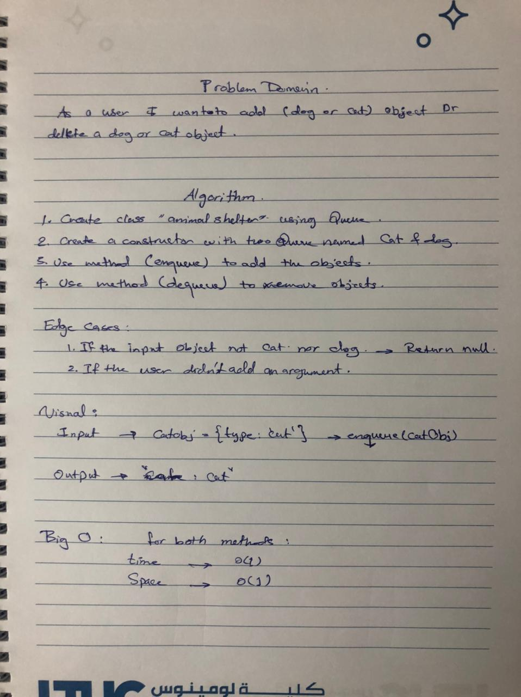

## Challenge Summary

Create a class called AnimalShelter which holds only dogs and cats. 

 

## Whiteboard Process

 

 

## Approach & Efficiency

My approach was to use the Queue to enqueue and dequeue a cat or a dog object using a first-in, first-out approach. 

For big O it's O(1) for time, and O(1) for space for both methods.
 

## Solution

[CLICK ON ME FOR SOLUTION CODE](fifo-animal-shelter.js)