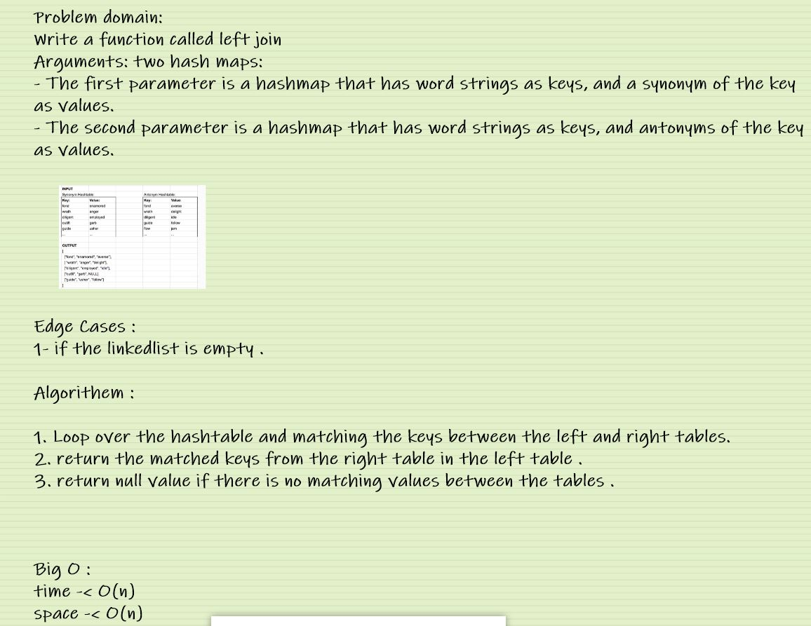

#  Hashmap LEFT JOIN

Write a function that LEFT JOINs two hashmaps into a single data structure.

Write a function called left join
Arguments: two hash maps
The first parameter is a hashmap that has word strings as keys, and a synonym of the key as values.
The second parameter is a hashmap that has word strings as keys, and antonyms of the key as values.
Return: The returned data structure that holds the results is up to you. It doesn’t need to exactly match the output below, so long as it achieves the LEFT JOIN logic

  ## Whiteboard Process

## Approach & Efficiency

Big O for time is O(n) and for space as well.

## Solution

[CLICK ON ME FOR SOLUTION CODE](./hashmapLeft.js)