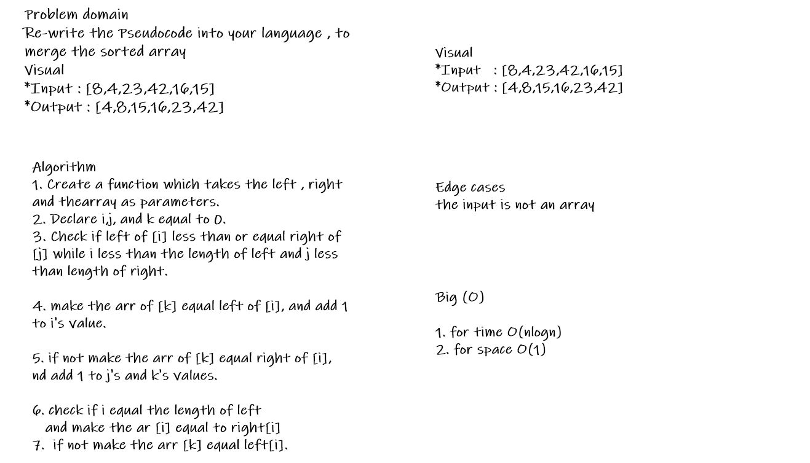

# Challenge Summary

To sort the specified list of elements, merge sort employs the divide-and-conquer strategy. It splits the problem down into smaller subproblems until they're easy to solve on their own. 

  ## Whiteboard Process

## Blog

[CLICK ON ME FOR READ BLOG](./blog.md)

## Solution

[CLICK ON ME FOR SOLUTION CODE](./mergeSort.js)

