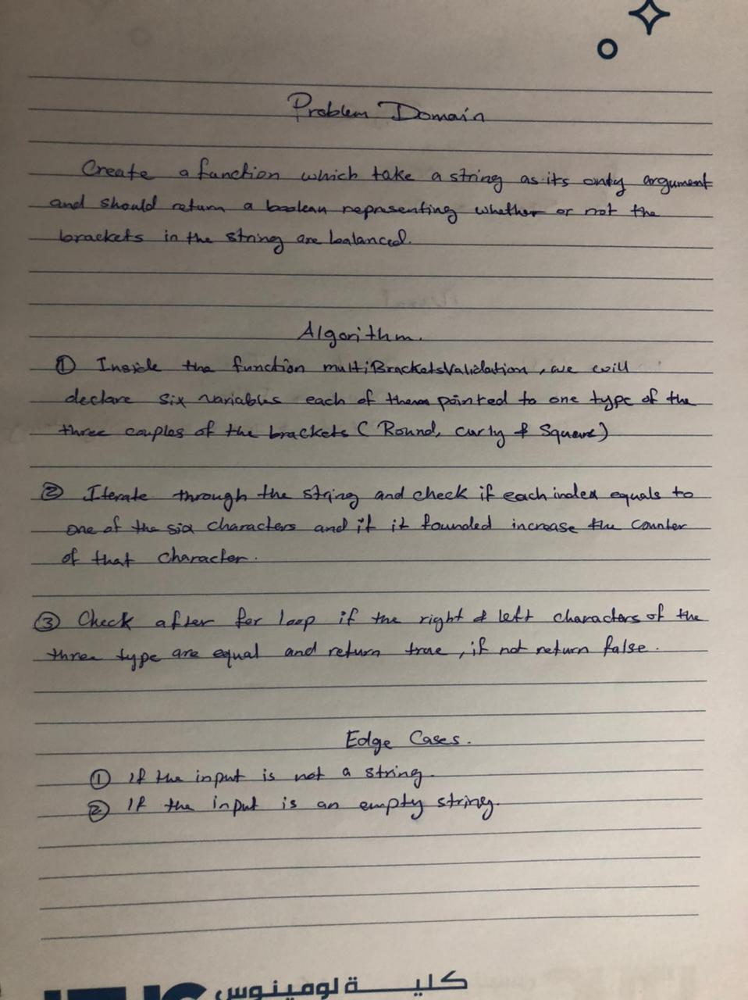

# Multi Bracket Validation

## Challenge Summary

The function should take a string as its only argument, and should return a boolean representing whether or not the brackets in the string are balanced   

## Whiteboard Process

 

## Approach & Efficiency

 My approach was to use for loop to look for the brackets in the string. 

 For big O it's O(n) for time, and O(n) for space.

 

## Solution

[CLICK ON ME FOR SOLUTION CODE](./multi-bracket-validation.js)