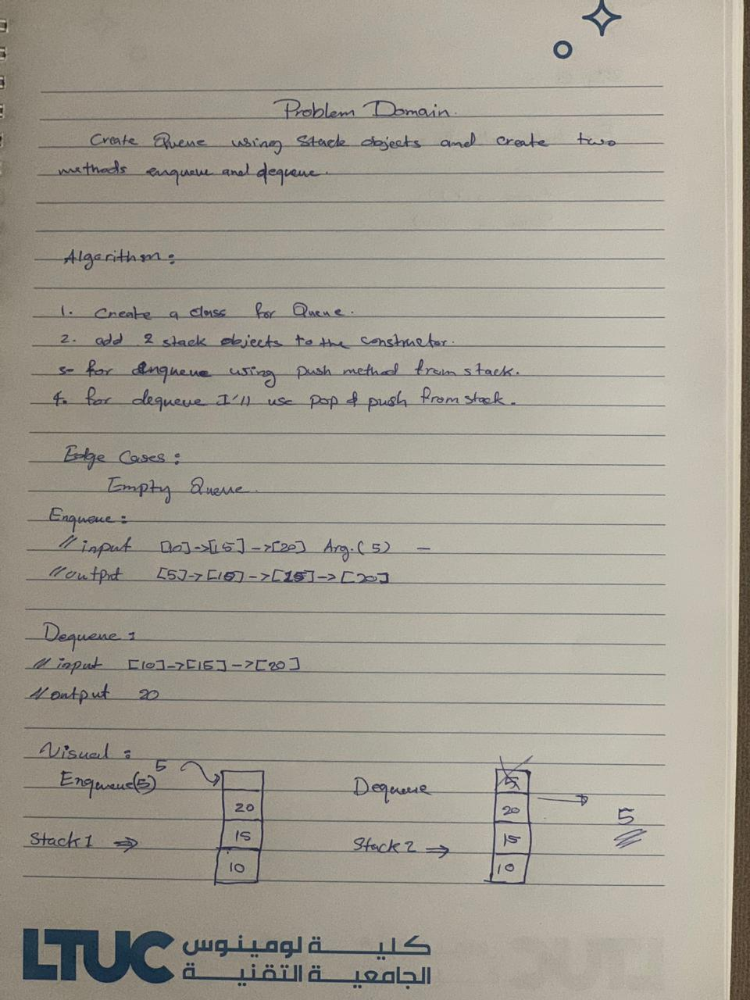
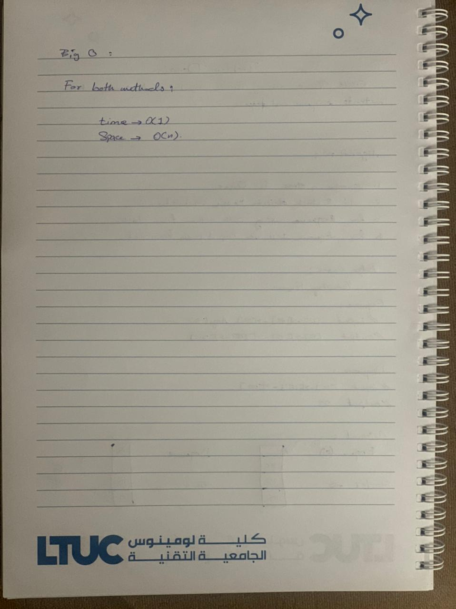

# Challenge Summary

We will use two stack object to implement standard queue interface with two of its methods(enqueue and dequeue).   

## Whiteboard Process

## Approach & Efficiency

 My approach was to use the stack objects to implement Queue and use them to dequeue and enqueue methods.

 For big O it's O(1) for time, and O(n) for space for both methods.

## Solution

[CLICK ON ME FOR SOLUTION CODE](./queue-with-stacks.js)