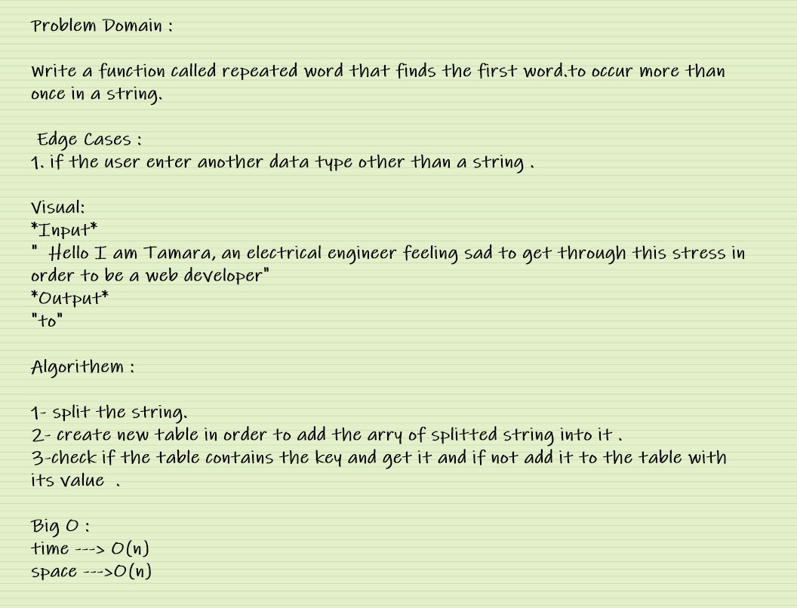

# Hash map repeated word

## Challenge Summary

Write a function called repeated word that finds the first word. to occur more than once in a string.   

## Whiteboard Process

 

## Approach & Efficiency

 My approach was to use for loop to look for the the repeated words inside the hash table. 

 For big O it's O(n) for time, and O(n) for space.

 

## Solution

[CLICK ON ME FOR SOLUTION CODE](./repeatedWord.js)