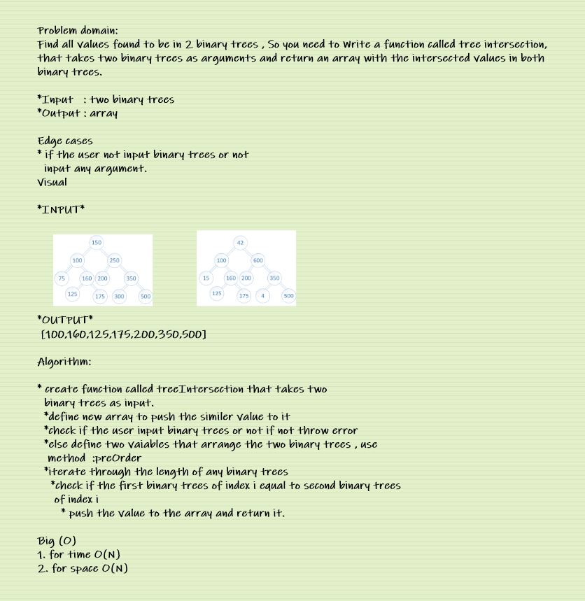

# Hash map repeated word

## Challenge Summary

Find all values found to be in 2 binary trees by writing a function called tree intersection
with arguments: two binary trees,and return an array

## Whiteboard Process

 

## Approach & Efficiency

 My approach was to use for loop to look for the the intersected values inside the binary table. 

 For big O it's O(n) for time, and O(n) for space.

 

## Solution

[CLICK ON ME FOR SOLUTION CODE](./treeIntersection.js)