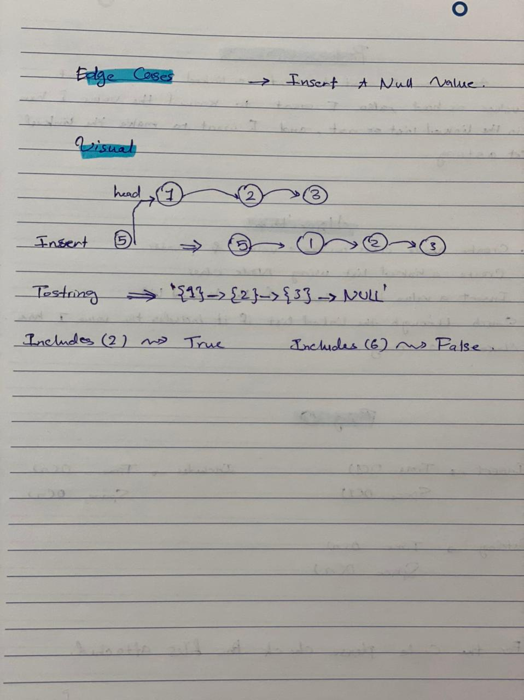
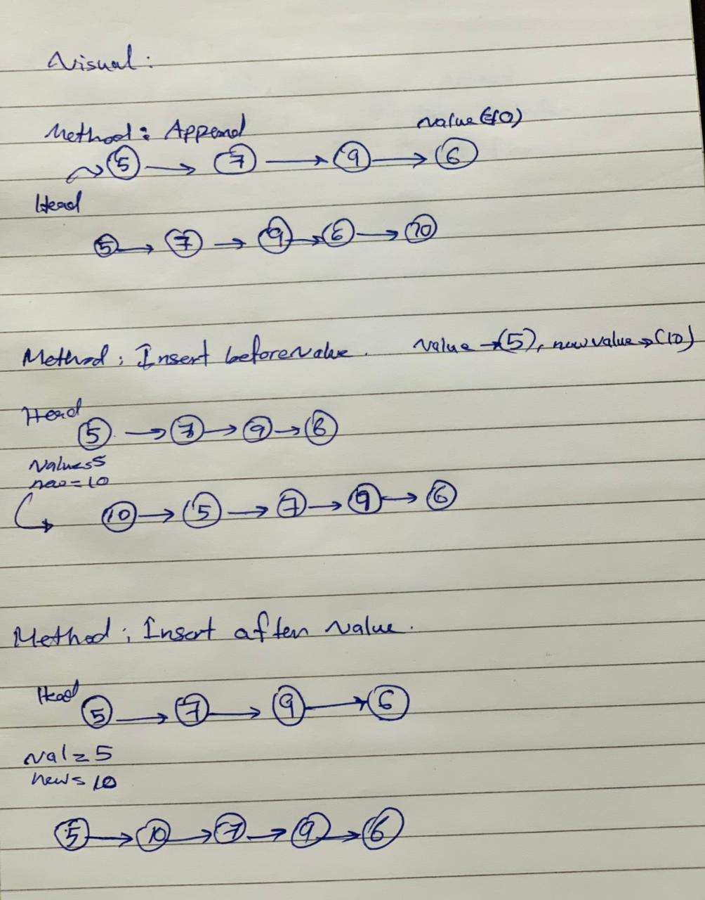
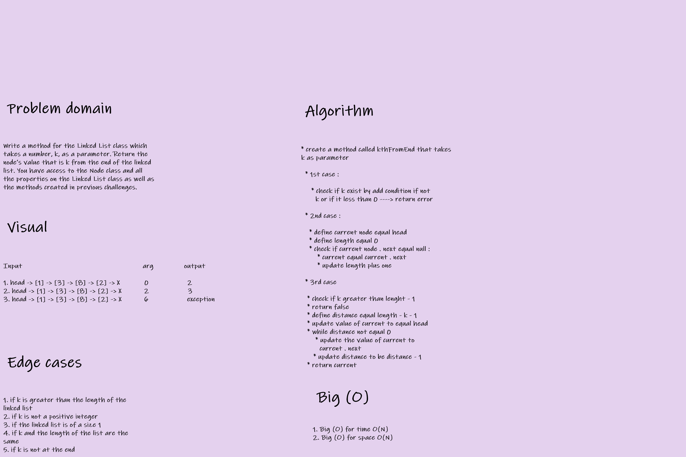

 # Singly Linked List

A singly linked list is a type of linked list that is unidirectional, it can be traversed in only one direction from head to the last node (tail). <br>
 A single node contains data and a pointer to the next node which helps in maintaining the structure of the list.

 ## Challenge

 Create a Node class that has properties for the value stored in the Node, and a pointer to the next Node.
Within your LinkedList class, include a head property. Upon instantiation, an empty Linked List should be created.


## API

 1. Method `insert` which takes any value as an argument and adds a new node with that value to the head of the list with an O(1) Time performance.
 1. Method `includes` which takes any value as an argument and returns a boolean result depending on whether that value exists as a Node’s value somewhere within the list.
 1. Method `toString` which takes in no arguments and returns a string representing all the values in the Linked List, formatted as:<br>
```"{ a } -> { b } -> { c } -> NULL"```
 1. `.append(value)` which adds a new node with the given value to the end of the list.
 1. `.insertBefore(value, newVal)` which add a new node with the given newValue immediately before the first value node.
 1. `.insertAfter(value, newVal)` which add a new node with the given newValue immediately after the first value node.

## Whiteboard Process

`Create:`


<br>




`Insertion:` 

<br>

<br>


<br>


<br>


`For K value whiteboard:`
<br>


