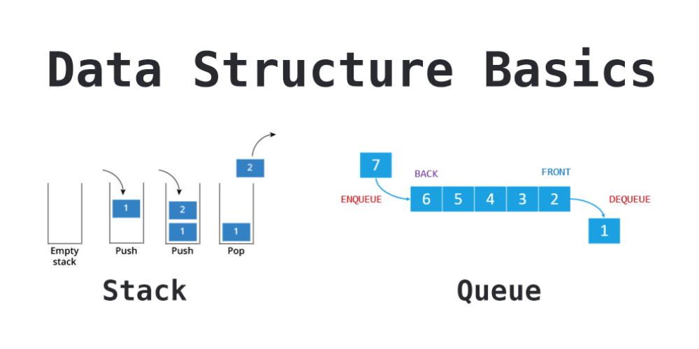
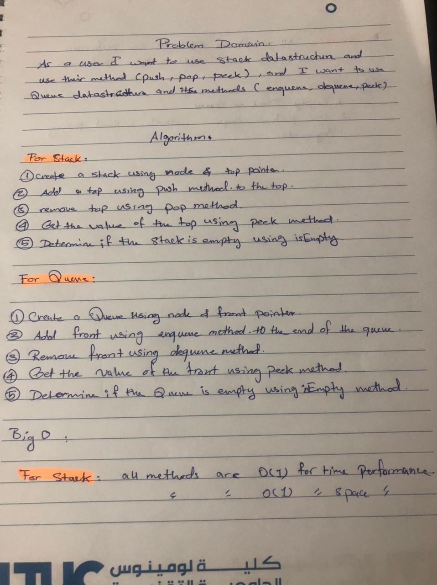
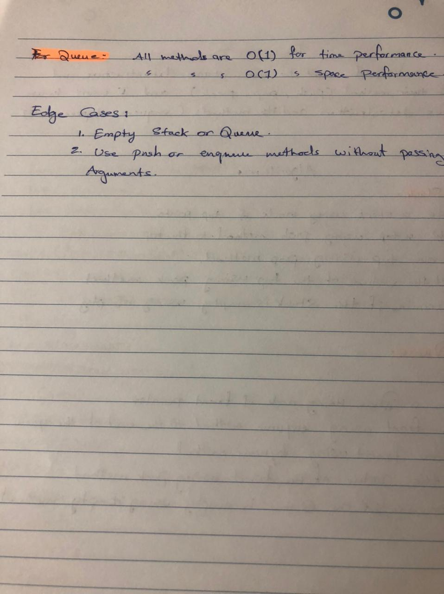

# Stacks and Queues

 A stack is a data structure that consists of Nodes. Each Node references the next Node in the stack, but does not reference its previous. 

A Queue is a linear structure which follows a particular order in which the operations are performed. The order is First In First Out (FIFO). 

## API

## Whiteboard

 

 

 

