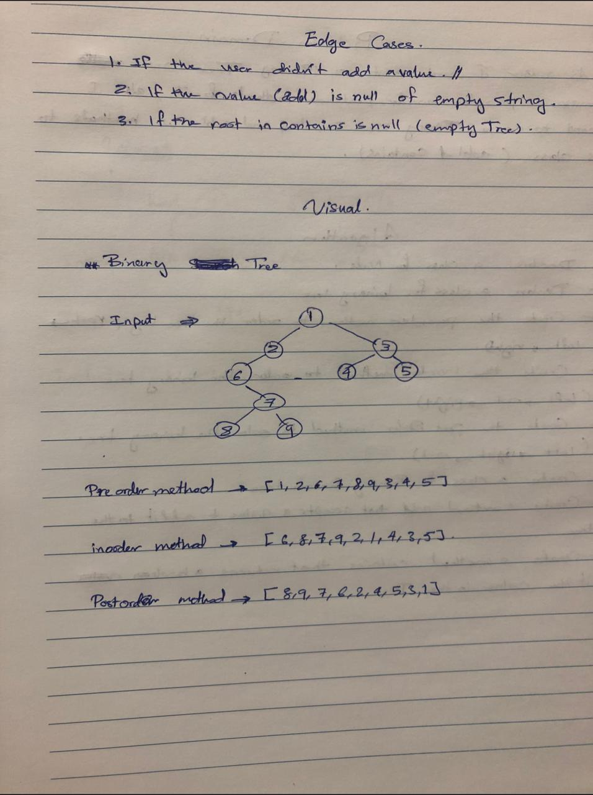
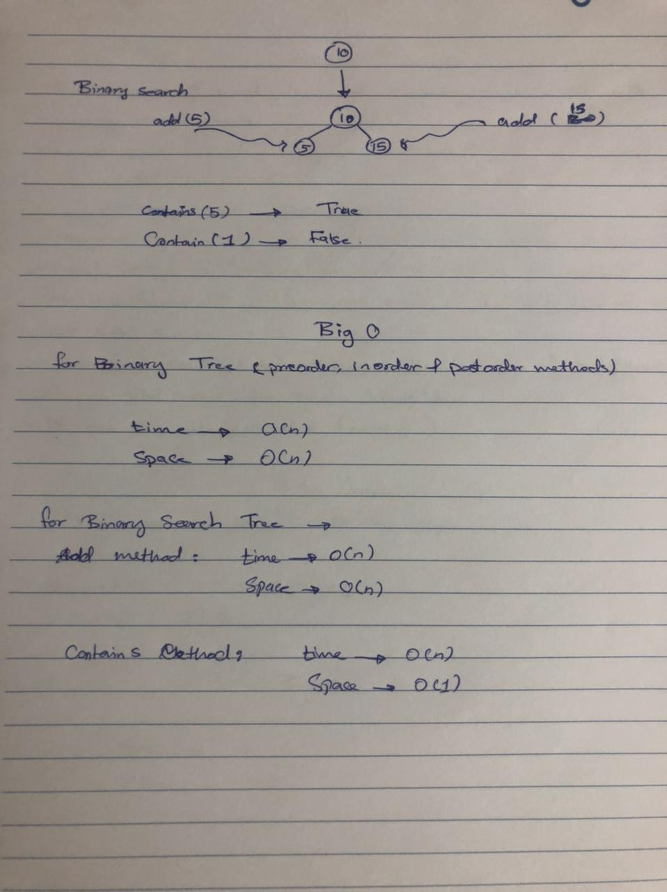
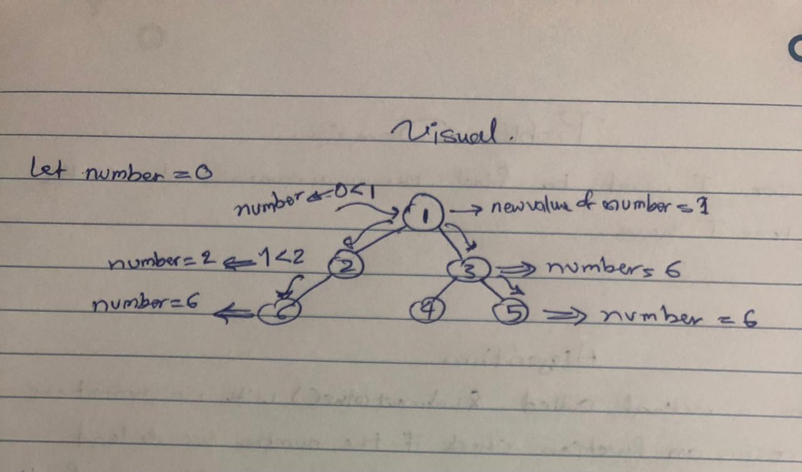
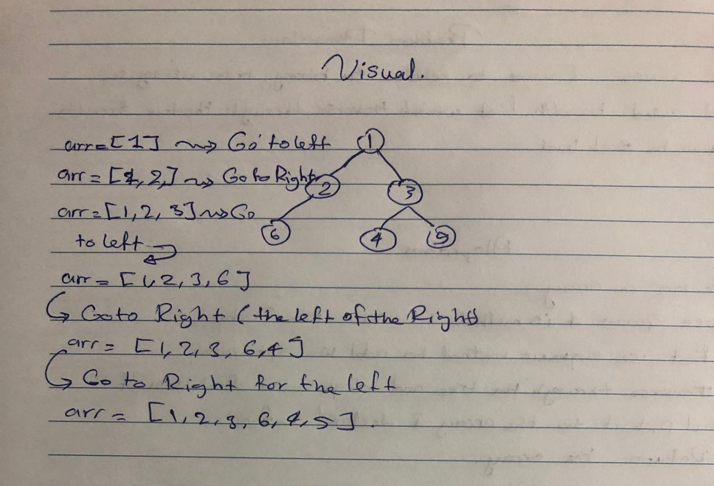

# Trees
A tree data structure is a non-linear data structure because it does not store in a sequential manner. It is a hierarchical structure as elements in a Tree are arranged in multiple levels. In the Tree data structure, the topmost node is known as a root node. Each node contains some data, and data can be of any type.

## Challenge 

- Create a Node class that has properties for the value stored in the node, the left child node, and the right child node.
- Create a BinaryTree class
Define a method for each of the depth first traversals called preOrder, inOrder, and postOrder which returns an array of the values, ordered appropriately.
- Create a BinarySearchTree class
  - Define a method named add that accepts a value, and adds a new node with that value in the correct location in the binary search tree.
  - Define a method named contains that accepts a value, and returns a boolean indicating whether or not the value is in the tree at least once.

## Whiteboard Process
 

## API
 

### For Binary Tree Class

- `preOrder`, `inOrder`, and `postOrder` methods which return an array of the values, ordered appropriately.

 - `findMaximumValue` method return the maximum value(numeric) stored in the tree. 

### For Binary Search Tree Class

 - `Add ` method accepts a value, and adds a new node with that value in the correct location in the binary search tree.
  
- `contains` method accepts a value, and returns a boolean indicating whether or not the value is in the tree at least once.

- `breadthFirst` method it returns a list of the values in the tree in the order they were encountered.
## Solution

[CLICK ON ME FOR SOLUTION CODE](./tree.js)

